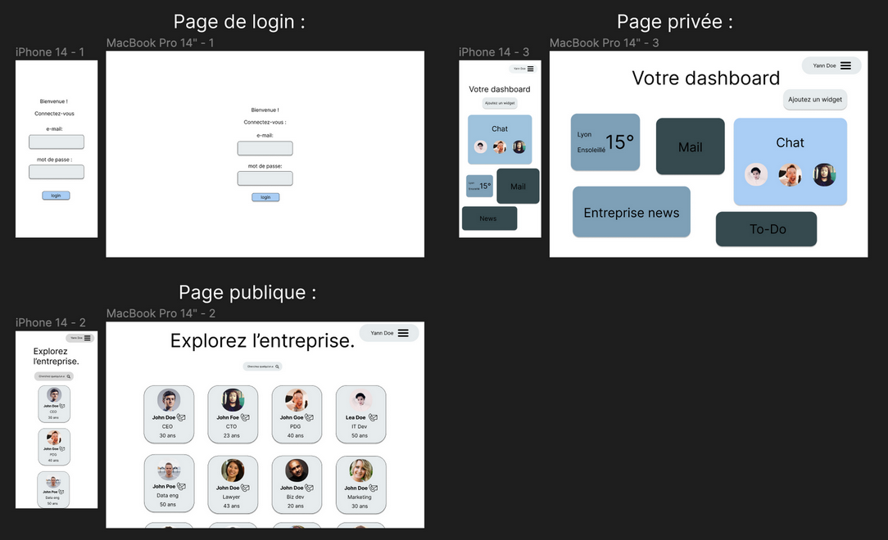

# Trombinoscope

Welcome to the Trombinoscope project made with React Native and Expo. This document describes the features, installation, and structure of this project.

## Technologies Used

This project uses several technologies to ensure a smooth and responsive experience:

- **React Native**: For creating the mobile application.
- **Expo**: To simplify development and deployment.
- **Firebase**: For data storage and user authentication.
  
## Features

The Trombinoscope project includes the following features:

1. **ToDo Widget**: Task management.
2. **Weather Widget**: Displays current weather forecasts.
3. **Notes Widget**: Quick note-taking.
4. **Clock Widget**: Displays the current time.
5. **Movable Widgets**: All widgets can be moved around the screen.
6. **Navigation Menu**: Allows page switching.
7. **Home Page**: Project overview page.
8. **Logout Button**: Allows users to log out of the application.
9. **Chat**: Integrated chat functionality.
10. **Organizational Chart**: Displays the company's organizational chart.

## Prerequisites

Before starting, make sure you have the following installed on your machine:

- Node.js
- npm or yarn
- Expo CLI

## Cleanup and Organization

- **Header Bar Removed**: The header bar has been removed for full-screen display.
- **Style Sorting**: The `style.js` file has been cleaned and reorganized for better readability.
- **Widget Functions**: Functions associated with the widgets have been cleaned and optimized.

## Specifications

The project meets the following requirements:

- Creation of widgets for various functionalities.
- Widgets movable on the screen.
- Increased security through the use of environment variables.
- Intuitive user interface with a navigation menu.
- Integrated chat functionality for internal communication.
- Company's organizational chart for hierarchical visualization.

## API Communication

This login page communicates with an API to authenticate users. Here is how it works:

- When the user submits the login form with a valid username and password, the page sends an HTTP request to a backend API.
- The backend API verifies the credentials provided by the user. If the credentials are correct, the API returns a positive authentication response.
- If the credentials are incorrect, the API returns a negative authentication response.
- The login page processes the API response and displays an appropriate message to the user, indicating whether they successfully logged in or not.

### API Error Codes

When using this login page, the backend API can return the following error codes in response to different situations:

- **Code 200 - Success**: This code indicates that the authentication was successful, and the user has logged in successfully.
- **Code 400 - Empty Fields**: If the user submits the login form with any fields (username or password) empty, the API returns this error code to indicate that all fields must be filled in.
- **Code 401 - Authentication Error**: This code means that the credentials provided by the user (username and password) do not match an existing account in the database.
- **Code 429 - Failed Authentication Limit**: In some cases, the API may impose a limit on the number of failed authentication attempts. If the user exceeds this limit, the API returns this error code to indicate that access to their account is temporarily blocked.
- **Code 500 - Request Error**: In case of an HTTP request error, such as if the API fails to properly receive the request from the login page, it returns this error code.
- **Code 500 - Technical Issues**: This error code is generated when the API encounters unexpected technical issues, such as server outages or database errors.
- **Code 403 - Unauthorized Access**: The API may return this error code if the user does not have the appropriate permissions to access the login page or the API itself.

## Login Page

This login page is a simple example of a user interface for authenticating users using a username and password.

### Features

- **Login Form**: Users can enter their username and password into the login form.
- **Data Validation**: The form validates the data to ensure that the fields are not empty.
- **Authentication**: When users submit the form, it checks if the login information is correct using a dummy method. In a real context, you would integrate actual authentication.
- **Error Messages**: If the credentials are incorrect or if the form is submitted with empty fields, an appropriate error message is displayed to the user.

## Trombinoscope Page

This Trombinoscope page is a simple example of a user interface that allows users to view photos and information about team or organization members.

### Features

- **Member Display**: The page displays a list of members with their photos, names, email, and job titles.
- **Member Search**: Users can search for specific members using a search field. Results are updated in real-time as the user types.
- **Member Details**: When users click on a member's profile, they can see more detailed information about the member, such as their email address, phone number, biography, etc.
- **Responsive**: The page is designed to be responsive, meaning it adapts to different devices and screen sizes.

### Access to Own Profile

On the Trombinoscope Page, each member has the ability to access their own profile using the "View My Profile" button. Here is how it works:

- **"View My Profile" Button**: Each member can find this button on the top bar of the Trombinoscope page. By clicking this button, the user will be redirected to their own profile page.

### Access to Dashboard and Widgets from the Profile

On the personal profile page, users will have the ability to access their dashboard and associated widgets. This dashboard provides quick access to several useful features, including:

- **Chat**: By clicking on the "Chat" icon on the dashboard, users can access an instant messaging tool to communicate with other team or organization members.
- **Email Preview**: The "Email Preview" icon allows users to quickly check their emails and view their inbox directly from their dashboard.
- **Weather Forecasts**: The "Weather Forecasts" widget provides users with real-time information on current weather conditions and forecasts for their region.
- **File Explorer**: The "File Explorer" option allows users to access, organize, and manage their files easily from their dashboard.

Accessing these widgets from the profile page offers a personalized and convenient experience for users, consolidating several important features in one place.

## Authors
- Matthis Brocheton
- Antoine Dufour

## Images

